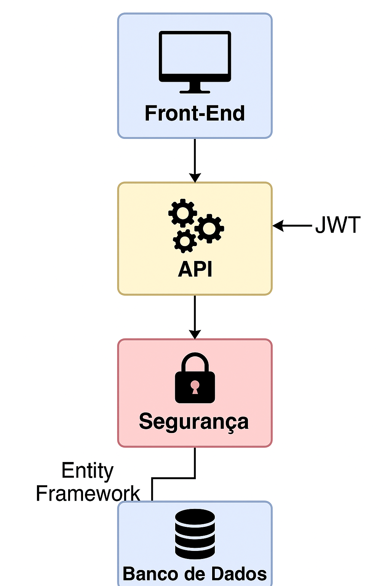

# Arquitetura do Sistema

## 🔷 Front-End
- Telas: Login, Home, Cadastro, Admin, Lista
- Conecta com a API via chamadas HTTP (fetch)

## 🔷 API ASP.NET
- Autenticação JWT
- Controllers → Services → Commands/Queries
- Middleware para verificação de token e roles

## 🔷 Banco de Dados
- MySQL com Entity Framework
- Tabelas: `Usuarios`, `Colaboradores`
- Relacionamento: Um usuário pode ter muitos colaboradores

## 🔐 Segurança
- Criptografia de senha com Bcrypt
- Autorização baseada em papel (admin / comum)

## 🗂️ Imagens da Arquitetura

📚 Veja mais detalhes [Arquitetura do sistema]()

📚 Veja mais detalhes [Arquitetura do sistema 2](
)

