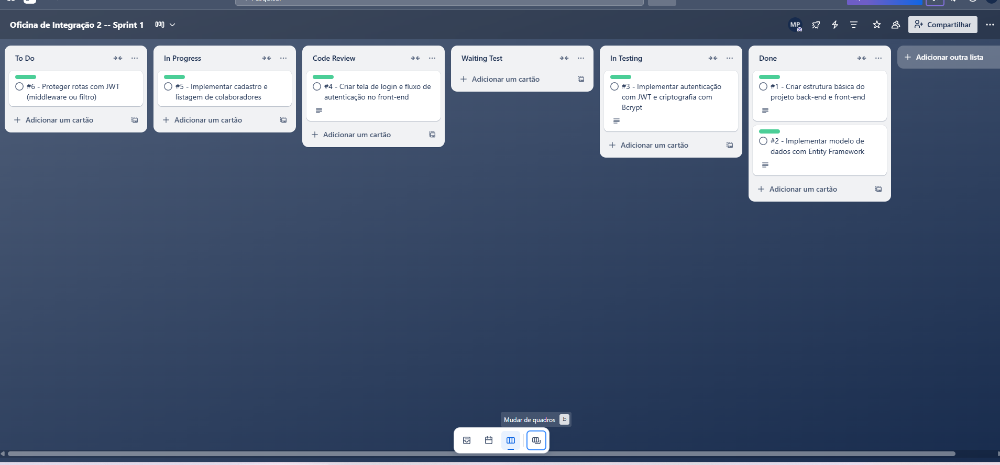
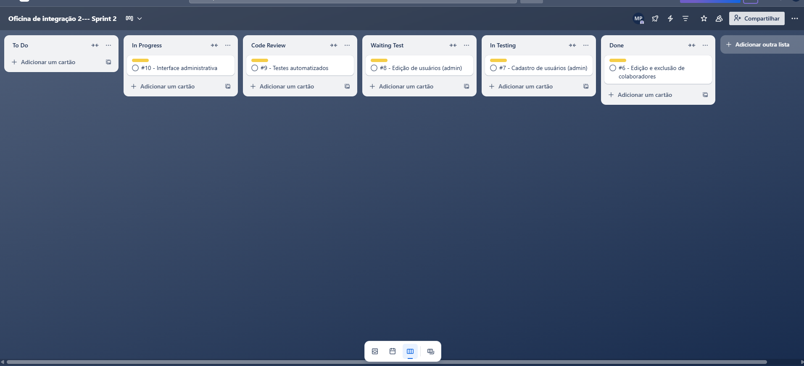

# 🗓️ Planejamento dos Sprints

Este documento apresenta a divisão das funcionalidades em dois sprints, conforme a metodologia Scrum adotada no projeto.

## Sprint 1 – Funcionalidades Básicas

- Estrutura inicial do projeto
- Autenticação com JWT
- Criptografia de senha com Bcrypt
- Tela de login e fluxo de autenticação
- Cadastro e listagem de colaboradores
- Testes básicos de login e cadastro

## Sprint 2 – Funcionalidades Avançadas

- Edição e exclusão de colaboradores
- Cadastro e edição de usuários (admin)
- Interface administrativa
- Validações e mensagens no front-end
- Testes de autorização e casos negativos

## Quadro Kanban

O gerenciamento de tarefas foi realizado utilizando o Trello:

🔗 [Acesse o quadro aqui SPRINT 1](https://trello.com/invite/b/682ce8c3bcb9f32438c56d20/ATTI88398521e285c901cad75bf553e8e9a880F45F2B/oficina-de-integracao-2-sprint-1)
🔗 [Acesse o quadro aqui SPRINT 2](https://trello.com/invite/b/682de302ce38dc62c2d0f273/ATTIe2c3a9d184c0bb1dc873bf898670d45e5067BB05/oficina-de-integracao-2-sprint-2)

Cada funcionalidade foi mapeada como um cartão, movido entre as colunas conforme o progresso.

SPRINT 1 

SPRINT 2

